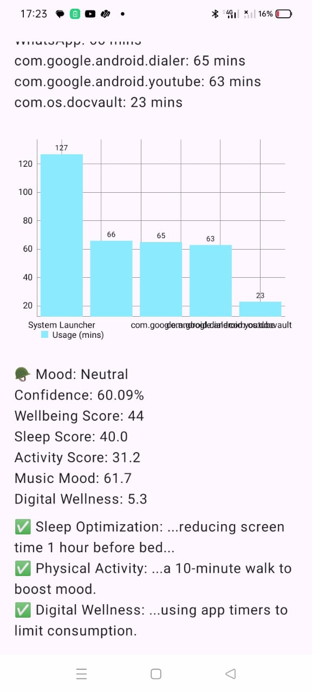
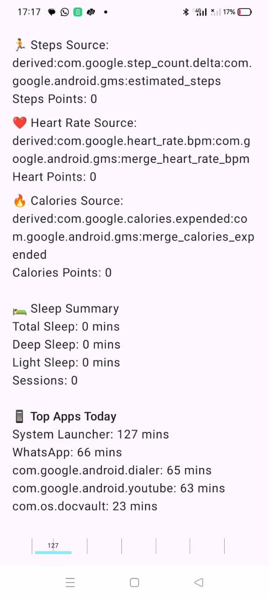
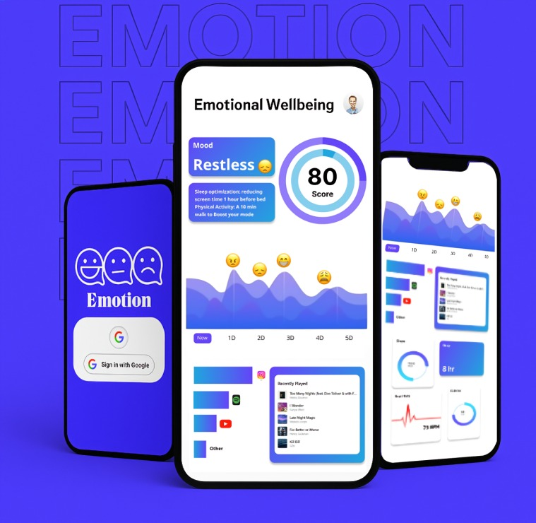
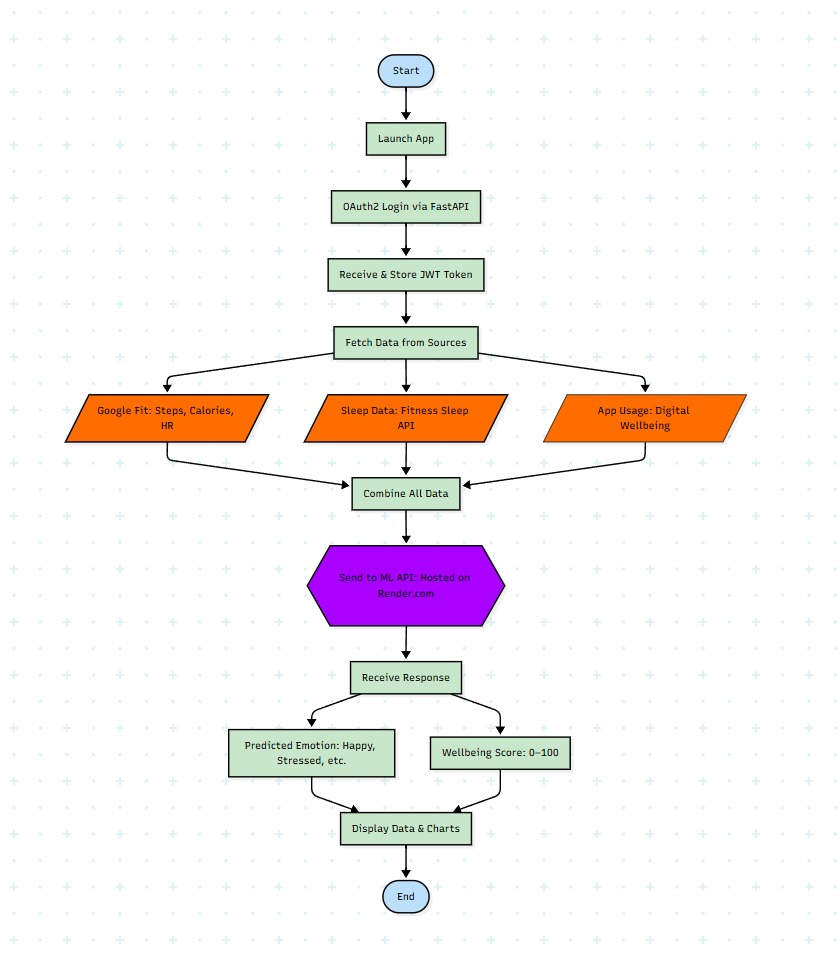

# WnW – Wellness Within

**WnW (Wellness Within)** is a smart emotional wellbeing app that helps users understand how their physical activity, screen time, sleep, and music choices affect their mood. It uses Google Fit, screen usage data, and Spotify listening behavior to calculate a personalized wellbeing score and generate health tips — powered by a machine learning model.

---

## Why WnW?

India faces a growing mental health crisis. Most people can't spot early signs of stress or depression, therapy is costly or unavailable, and stigma stops them from seeking help. Health data is scattered across apps, leaving no clear picture of overall mental well-being — especially in rural communities.

WnW empowers users to take control of their emotional wellbeing by reflecting their habits back to them with insight — not just numbers. It turns smartphones into 24/7 culturally-aware wellness companions, offering affordable, stigma-free, and proactive mental health monitoring.

> **Important:** To track fitness data accurately, please ensure your smartwatch is connected to **Google Fit** via your watch's local app (WearOS, Mi Fit,Boat Crest etc.).

---

## 🌐 Our Solution

Our AI-powered Android app aggregates Google Fit, sleep, screen time, and music data to generate wellbeing scores and predict emotional states. It uses machine learning to detect early mental health patterns, providing personalized recommendations before crises occur.

WnW makes mental health tracking accessible and stigma-free for Indians by leveraging data users already generate and delivering culturally-sensitive insights via a private, smartphone-first experience.

---

## 👤 Who Is This For?

**Primary Users:**
- Tech-savvy **young professionals (22–35)** and **college students (18–25)** facing academic or workplace stress
- Already track fitness and stream music but lack integrated wellness insights

**Secondary Audience:**
- Urban working parents
- Rural youth with smartphones
- Anyone seeking affordable, private, and proactive mental health support without social stigma

---

## 🗂️ Project Overview

| Component   | Description                                                                 |
|-------------|-----------------------------------------------------------------------------|
| 📱 Android App | Kotlin app using Jetpack Compose for UI & Retrofit for APIs              |
| 🔁 Backend API | FastAPI app that handles OAuth (Google, Spotify), collects and formats data |
| 🤖 ML Model    | FastAPI microservice using scikit-learn to predict mood, wellbeing and personalize user experience.     |

---

## ✨ Key Features

### ✅ Android Frontend
- Built using Kotlin + Jetpack Compose
- OAuth login using browser flow via FastAPI backend
- Collects:
  -  Sleep duration
  -  Steps, heart rate, calories (Google Fit)
  -  Screen time (Instagram, YouTube, X, Reddit via `UsageStatsManager`)
- Displays:
  - Emoji-based mood
  - Wellbeing score (0–100)
  - Graphs for app usage & health
  - Daily recommendations from ML output

### ✅ FastAPI Backend
- OAuth2 Login with Google Fit *(Spotify login and analysis coming soon)*
- Fetches:
  - Sleep data via Sessions API
  - Steps, heart rate, calories via Fitness API
- Computes:
  - Total screen time and `socialTime` (sum of app durations)
  - Structured JSON to send to ML model
- Returns formatted insights to Android app

### ✅ ML Microservice
- Receives structured JSON payload
- Predicts:
  - Emotion: e.g. `"Content"`, `"Tired"`, `"Stressed"`
  - Wellbeing score (0–100)
  - Category-wise scores (sleep, activity, music mood, etc.)
  - Personalized health/music/lifestyle tips

---

## 📱 App UI Preview

### Current Screenshots

  
  
  

### Proposed UI Design

  

---

## 🔁 App Flowchart

---

## 🧰 Libraries Used

### Android:
- Jetpack Compose
- Retrofit + Coroutine + LifecycleScope
- MPAndroidChart
- UsageStatsManager
- Google Fit API

### Backend:
- FastAPI
- `google-auth`, `requests`, `httpx`
- Spotify Web API integration

### ML Model:
- scikit-learn (GradientBoostingClassifier)
- joblib for model persistence
- FastAPI for model serving

### Tools used:
- Cloud hosting using render for backend and ML model.
---

## ⚠️ App Permissions

> To ensure full functionality, users must grant the app permission to access screen usage data. When prompted, please allow "Usage Access" for WnW in your device settings.

---

## 📦 APK Download

🔗 [Download WnW.apk](https://github.com/DARVINDROLE/DynamicDino/raw/refs/heads/main/app-debug.apk)

> 📱 Allow install from unknown sources. Recommended for Android 9+.

---

## 🔮 Explanation Video

Watch how WnW works in this short walkthrough video:

---

## 💭 Future Improvements

- 🧠 Upgrade ML with reinforcement learning using real-time feedback
- 📸 Use facial expression tracking every 15 minutes (secured via blockchain)
- 🏥 Add user medical condition & medication tracking
- 🗓️ Weekly summary + notifications when wellbeing score is low
- 🎵 Spotify Integration for music analysis 
---

## 👨‍💼 Team

- **ML Model:** Ketan Mali  
- **Android Frontend:** Laukik Kande  
- **Backend & APIs:** Yashovardhan Poddar  

Made for Samsung Solve for Tomorrow 2025

---
